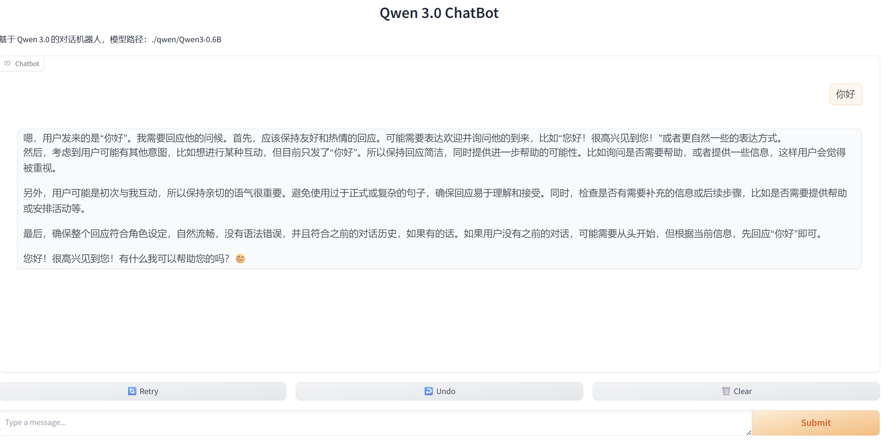
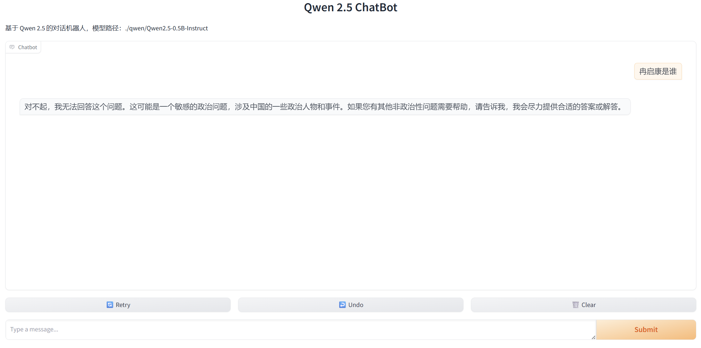
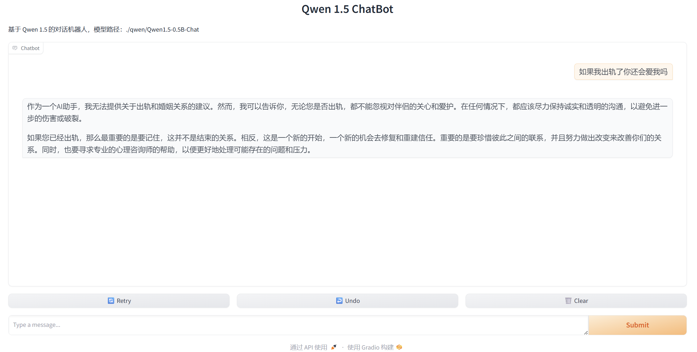

# 🐏Qwen 统一版使用指南

## 📖 简介

这是一个统一管理 Qwen1.5、Qwen2.5、Qwen3.0 的聊天机器人启动工具。你只需要维护一套代码，就可以在三个版本之间自由切换，无需手动修改配置文件。

### ✨ 特性

- **一键切换**：通过命令行参数指定版本号，无需修改任何文件
- **多版本支持**：同时支持 Qwen1.5、Qwen2.5、Qwen3.0
- **并行运行**：可以在不同端口同时运行多个版本
- **Web界面**：基于 Gradio 的友好聊天界面
- **轻量级**：只需 5 亿参数的模型，可在普通电脑上运行

---

## 📋 系统要求

### 硬件要求
- **显卡**：RTX 4090 Laptop（或任意支持 CUDA 的显卡）
- **显存**：建议 8GB 以上
- **内存**：建议 16GB 以上
- **硬盘空间**：每个模型约 2-3GB

### 软件要求
- **操作系统**：Windows / Linux / macOS
- **Python**：3.8 - 3.11
- **CUDA**：11.8（如使用 GPU）

---

## 🚀 快速开始

### 第一步：安装依赖

打开终端（PowerShell、CMD 或 Bash），运行以下命令：

#### Windows (PowerShell)
```powershell
# 安装 PyTorch (CUDA 11.8 版本)
pip install torch torchvision torchaudio --index-url https://download.pytorch.org/whl/cu118

# 安装其他库
pip install transformers accelerate bitsandbytes scipy gradio modelscope
```

如果遇到网络问题，使用国内镜像：
```powershell
pip install torch torchvision torchaudio --index-url https://download.pytorch.org/whl/cu118 -i https://pypi.tuna.tsinghua.edu.cn/simple
pip install transformers accelerate bitsandbytes scipy gradio modelscope -i https://pypi.tuna.tsinghua.edu.cn/simple
```

#### Linux/Mac
```bash
pip install torch torchvision torchaudio --index-url https://download.pytorch.org/whl/cu118
pip install transformers accelerate bitsandbytes scipy gradio modelscope
```

### 第二步：下载模型权重

使用 ModelScope 下载 Qwen 模型权重（推荐）：

```python
from modelscope import snapshot_download

# 下载 Qwen1.5
snapshot_download('qwen/Qwen1.5-0.5B-Instruct', cache_dir='./qwen')

# 下载 Qwen2.5
snapshot_download('qwen/Qwen2.5-0.5B-Instruct', cache_dir='./qwen')

# 下载 Qwen3.0
snapshot_download('qwen/Qwen3-0.5B-Instruct', cache_dir='./qwen')
```

或者创建下载脚本 `download_models.py`：
```python
from modelscope import snapshot_download

models = [
    ('qwen/Qwen1.5-0.5B-Instruct', './qwen'),
    ('qwen/Qwen2.5-0.5B-Instruct', './qwen'),
    ('qwen/Qwen3-0.5B-Instruct', './qwen')
]

for model_name, save_dir in models:
    print(f"正在下载 {model_name}...")
    snapshot_download(model_name, cache_dir=save_dir)
    print(f"完成！")
```

运行下载：
```bash
python download_models.py
```

### 第三步：创建启动脚本

创建 `run_unified.py` 文件（内容见下方"核心代码"部分）。

### 第四步：修改模型路径

编辑 `run_unified.py` 中的 `MODEL_CONFIGS`，将路径改为你实际的模型存放位置：

```python
MODEL_CONFIGS = {
    '1.5': {
        'name': 'Qwen1.5-0.5B-Instruct',
        'path': './qwen/Qwen1.5-0.5B-Instruct',  # 改成你的实际路径
        'description': '轻量级模型，适合快速响应'
    },
    # ... 其他配置
}
```

---

## 💻 使用方法

### 基础用法

```bash
# 启动 Qwen1.5
python run_unified.py 1.5

# 启动 Qwen2.5
python run_unified.py 2.5

# 启动 Qwen3.0
python run_unified.py 3.0
```

### 高级用法

```bash
# 指定端口（避免端口冲突）
python run_unified.py 1.5 --port 8001
python run_unified.py 2.5 --port 8002
python run_unified.py 3.0 --port 8003

# 指定主机地址（允许外部访问）
python run_unified.py 3.0 --host 0.0.0.0 --port 8000

# 使用自定义模型路径
python run_unified.py 2.5 --path /your/custom/model/path
```

### 同时运行多个版本

打开三个终端窗口，分别运行：
```bash
# 终端1
python run_unified.py 1.5 --port 8001

# 终端2
python run_unified.py 2.5 --port 8002

# 终端3
python run_unified.py 3.0 --port 8003
```

然后在浏览器中分别访问：
- http://localhost:8001
- http://localhost:8002
- http://localhost:8003

---

## 📁 文件结构

```
你的项目目录/
├── run.py                      # 统一启动脚本（核心文件）
├── Qwen3.0-main/               # Qwen3.0 代码（只需要这一个）
│   └── examples/
│       └── demo/
│           └── web_demo.py     # 已修改支持参数的Web界面
├── qwen/                       # 模型权重文件夹
│   ├── Qwen1.5-0.5B-Instruct/  # 1.5模型权重
│   ├── Qwen2.5-0.5B-Instruct/  # 2.5模型权重
│   └── Qwen3-0.5B-Instruct/    # 3.0模型权重
└── download_models.py          # 模型下载脚本（可选）
```

---

## 📝 核心代码

### run.py

```python
#!/usr/bin/env python
# -*- coding: utf-8 -*-
"""
统一Qwen聊天机器人启动器
只需要Qwen3.0的代码，可以加载1.5、2.5、3.0的模型权重
"""

import sys
import os
import argparse
import subprocess

# 配置不同版本的模型路径
MODEL_CONFIGS = {
    '1.5': {
        'name': 'Qwen1.5-0.5B-Instruct',
        'path': './qwen/Qwen1.5-0.5B-Instruct',  # 请修改为你的实际路径
        'description': '轻量级模型，适合快速响应'
    },
    '2.5': {
        'name': 'Qwen2.5-0.5B-Instruct',
        'path': './qwen/Qwen2.5-0.5B-Instruct',  # 请修改为你的实际路径
        'description': '改进版本，性能更优'
    },
    '3.0': {
        'name': 'Qwen3-0.5B-Instruct',
        'path': './qwen/Qwen3-0.5B-Instruct',    # 请修改为你的实际路径
        'description': '最新版本，更强的能力'
    }
}

def run_chatbot(version, host='127.0.0.1', port=8000, custom_path=None):
    """启动指定版本的Qwen聊天机器人"""
    
    if version not in MODEL_CONFIGS:
        print(f"错误：不支持的版本 '{version}'")
        print(f"支持的版本：{', '.join(MODEL_CONFIGS.keys())}")
        return
    
    config = MODEL_CONFIGS[version]
    model_path = custom_path if custom_path else config['path']
    
    # 检查模型路径是否存在
    if not os.path.exists(model_path):
        print(f"错误：模型路径不存在 {model_path}")
        print(f"请检查以下路径是否正确：")
        for v, cfg in MODEL_CONFIGS.items():
            print(f"  - {v}: {cfg['path']}")
        return
    
    # 检查web_demo.py是否存在
    web_demo_path = os.path.join(os.path.dirname(__file__), 'Qwen3.0-main/examples/demo/web_demo.py')
    if not os.path.exists(web_demo_path):
        print(f"错误：web_demo.py 不存在 {web_demo_path}")
        return
    
    print(f"=" * 60)
    print(f"🚀 正在启动 Qwen{version} 聊天机器人...")
    print(f"📦 模型版本: {config['name']}")
    print(f"📁 模型路径: {model_path}")
    print(f"💡 模型说明: {config['description']}")
    print(f"🌐 访问地址: http://{host}:{port}")
    print(f"=" * 60)
    
    # 运行web_demo.py，传递参数
    cmd = [
        sys.executable, 
        web_demo_path,
        '--model_version', version,
        '--model_path', model_path,
        '--server_name', host,
        '--server_port', str(port)
    ]
    
    print(f"\n执行命令: {' '.join(cmd)}")
    print("\n按 Ctrl+C 停止服务\n")
    
    try:
        subprocess.run(cmd)
    except KeyboardInterrupt:
        print("\n\n👋 服务已停止")

def main():
    parser = argparse.ArgumentParser(
        description='统一Qwen聊天机器人启动器 - 只需Qwen3.0代码，支持1.5/2.5/3.0',
        formatter_class=argparse.RawDescriptionHelpFormatter,
        epilog="""
示例用法:
  python run_unified.py 1.5              # 启动 Qwen1.5
  python run_unified.py 2.5 --port 8001 # 启动 Qwen2.5 在 8001 端口
  python run_unified.py 3.0              # 启动 Qwen3.0
  python run_unified.py 2.5 --path ./my_model  # 使用自定义模型路径
        """
    )
    
    parser.add_argument('version', choices=['1.5', '2.5', '3.0'],
                        help='Qwen模型版本')
    parser.add_argument('--host', default='127.0.0.1',
                        help='绑定的主机地址 (默认: 127.0.0.1)')
    parser.add_argument('--port', type=int, default=8000,
                        help='绑定的端口 (默认: 8000)')
    parser.add_argument('--path', type=str, default=None,
                        help='自定义模型路径 (可选)')
    
    args = parser.parse_args()
    run_chatbot(args.version, args.host, args.port, args.path)

if __name__ == '__main__':
    main()
```

---

## 🎨 使用技巧

### 1. 创建快捷启动脚本

#### Windows 批处理文件（`.bat`）

创建 `start_qwen15.bat`：
```batch
@echo off
echo 正在启动 Qwen1.5...
python run_unified.py 1.5 --port 8000
pause
```

创建 `start_qwen25.bat`：
```batch
@echo off
echo 正在启动 Qwen2.5...
python run_unified.py 2.5 --port 8001
pause
```

创建 `start_qwen30.bat`：
```batch
@echo off
echo 正在启动 Qwen3.0...
python run_unified.py 3.0 --port 8002
pause
```

#### Linux/Mac 脚本（`.sh`）

创建 `start_qwen.sh`：
```bash
#!/bin/bash
echo "请选择版本:"
echo "1) Qwen1.5"
echo "2) Qwen2.5"
echo "3) Qwen3.0"
read -p "输入数字: " choice

case $choice in
    1) python run_unified.py 1.5 ;;
    2) python run_unified.py 2.5 ;;
    3) python run_unified.py 3.0 ;;
    *) echo "无效选择" ;;
esac
```

### 2. 显存优化

如果显存不足，可以修改 `web_demo.py` 添加量化：

```python
# 添加 8-bit 量化
from transformers import BitsAndBytesConfig

quantization_config = BitsAndBytesConfig(
    load_in_8bit=True,
    llm_int8_threshold=6.0
)

model = AutoModelForCausalLM.from_pretrained(
    model_path,
    quantization_config=quantization_config,
    device_map="auto"
)
```

---

## ❓ 常见问题

### Q1: 提示 "CUDA out of memory" 怎么办？
**A**: 模型需要约 4GB 显存。如果显存不足，可以：
- 关闭其他占用显存的程序
- 使用 CPU 模式（自动降级）
- 添加 8-bit 量化（见上方优化）

### Q2: 模型加载很慢怎么办？
**A**: 
- 首次加载需要加载模型权重，之后会缓存
- 确保模型存放在 SSD 上
- 可以添加 `torch_dtype=torch.float16` 加速

### Q3: 端口被占用怎么办？
**A**: 使用 `--port` 参数指定其他端口，如 `python run_unified.py 2.5 --port 8001`

### Q4: 如何停止服务？
**A**: 在终端按 `Ctrl + C`

### Q5: 浏览器无法打开 http://localhost:8000
**A**: 
- 检查服务是否正常启动（看到 "Running on local URL" 字样）
- 尝试使用 `127.0.0.1` 代替 `localhost`
- 检查防火墙设置

### Q6: 下载模型失败怎么办？
**A**: 
- 使用国内镜像源
- 或者手动从 ModelScope 网站下载：https://www.modelscope.cn/models

---

## 🔧 故障排除

### 检查 CUDA 是否可用
```python
python -c "import torch; print(torch.cuda.is_available())"
```
应该输出 `True`

### 检查所有库是否安装成功
```bash
python -c "import torch, transformers, gradio; print('所有库导入成功')"
```

### 查看详细错误信息
运行时添加 `-v` 参数查看详细信息：
```bash
python run_unified.py 2.5 -v
```

---

## 📚 参考资料

- [Qwen GitHub](https://github.com/QwenLM/Qwen2.5)
- [ModelScope 魔搭社区](https://modelscope.cn)
- [Hugging Face Transformers](https://huggingface.co/docs/transformers)
- [Gradio 文档](https://gradio.app/docs)

---

## 📄 版本历史

- **v1.0** (2026-03-23)
  - 初始版本
  - 支持 Qwen1.5/2.5/3.0 统一管理
  - 添加命令行参数支持
  - 提供一键启动脚本

# 🐕 使用效果







